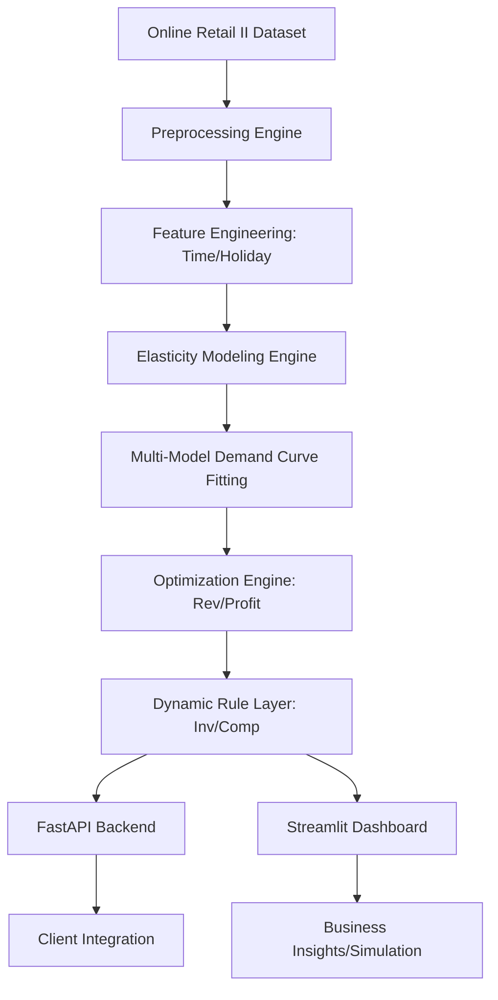

<sub>Created by K MOKSHITH SRI VISHNU</sub>

<p align="left">
  
  
  
  
  
  
  
</p>

# 📈 Dynamic Pricing System

An end-to-end Machine Learning solution to determine optimal product pricing using historical transaction data from the Online Retail II dataset.

## ❓ Problem Statement
In the modern e-commerce landscape, **static pricing** is a major bottleneck to profitability. Retailers often face the "Elasticity Gap":
1. **Underpricing Inelastic Goods:** Missing out on significant profit margins for products where customers are less sensitive to price increases.
2. **Overpricing Elastic Goods:** Losing market share and volume for products where small price hikes lead to drastic drops in demand.
3. **Inventory Mismatch:** Failing to clear slow-moving stock via discounts or capitalize on scarcity through premium pricing.
4. **Delayed Response:** Inability to react to competitor price moves or seasonal demand shifts in real-time.

This project solves these challenges by creating a system that learns demand behavior directly from transaction history and automates price recommendations.

## 🏗 System Architecture

The system is built with a modular architecture to ensure scalability and ease of deployment.



## 🧠 Under the Hood (How it Works)

### 1. Modeling Demand Sensitivity
The system uses **Price Elasticity of Demand (PED)**. Under the hood, we fit a Power Function:
$Q = a \cdot P^e$
Taking the natural log of both sides converts this into a linear regression problem (Log-Log Model):
$\ln(Q) = \ln(a) + e \cdot \ln(P) + \epsilon$
Where **$e$** is the coefficient representing price elasticity. 

### 2. Multi-Model Selection
Not all products follow a power law. We concurrently fit three models to ensure the best possible fit:
- **Log-Log:** $\ln(Q) = \beta_0 + \beta_1 \ln(P)$ (Assumes constant elasticity).
- **Linear:** $Q = \beta_0 + \beta_1 P$ (Assumes constant change in quantity).
- **Log-Linear:** $\ln(Q) = \beta_0 + \beta_1 P$ (Assumes demand decays exponentially).
The system calculates the **R-squared** for each and selects the most accurate model for every SKU.

### 3. Optimization Logic
Once a model $Q(P)$ is selected, the system maximizes two specific objectives:
- **Revenue Optimization:** Find $P$ that maximizes $P \cdot Q(P)$.
- **Profit Optimization:** Find $P$ that maximizes $(P - Cost) \cdot Q(P)$.
Using **Brent's method**, the system searches for the global maximum within a defined search space, ensuring we don't recommend "dead prices" (e.g., zero or infinity).

### 4. Dynamic Adjustment Layer
Theoretical optimums are adjusted using a **Heuristic Layer**:
- **Time/Seasonality:** Demand multipliers (e.g., +20% for weekends, +30% for Nov-Dec) signal the system to test higher price points.
- **Inventory Scarcity:** A 10% premium is applied when stock is low (<20%) to slow down the sell-through rate while maximizing margin.
- **Inventory Clearance:** A 5% discount is applied to overstocked items (>80%) to free up capital.
- **Competitor Matching:** The system matches a competitor's price if it's within a 10% range, but avoids a "race to the bottom" by capping drops based on cost.

## 🚀 Key Features
- **Price Elasticity Explorer:** Deep dive into individual SKU sensitivity with visual demand curves.
- **Pricing Optimizer:** Interactive tool for revenue and profit maximization with real-time cost inputs.
- **Monte Carlo Simulator:** Executes 1,000 simulations per price point with random demand noise (±10%) to provide 95% confidence intervals.
- **Portfolio Overview:** High-level segmentation (Premium, Competitive, Bundle, Discount) based on a revenue-elasticity matrix.
- **RESTful API:** Deployable FastAPI endpoints for programmatic price updates.

## 🛠 Setup & Usage

### Option 1: Local Installation
1. **Install Dependencies:**
   ```bash
   pip install -r requirements.txt
   ```
2. **Data Preparation:**
   Ensure `online_retail.csv` is in `data/`, then run:
   ```bash
   python precompute.py
   ```
3. **Run UI:**
   ```bash
   streamlit run app.py
   ```
4. **Run API:**
   ```bash
   uvicorn main:app --reload
   ```

### Option 2: Docker Deployment (Recommended)
The system is fully containerized for easy deployment using Docker Compose.
1. **Build and Start:**
   ```bash
   docker-compose up --build
   ```
2. **Accessing the apps:**
   - **Dashboard:** [http://localhost:8501](http://localhost:8501)
   - **API:** [http://localhost:8000](http://localhost:8000)
   - **API Documentation:** [http://localhost:8000/docs](http://localhost:8000/docs)

## 📡 API Documentation
- `GET /products`: Returns a list of all products with metadata.
- `POST /optimize`: Calculate the revenue and profit-maximized price for a SKU.
- `POST /simulate`: Simulate the impact of a custom price change on demand and profit.
- `GET /health`: System health check.

## 🤝 Credits
<sub>Created and Maintained by **K MOKSHITH SRI VISHNU**</sub>
